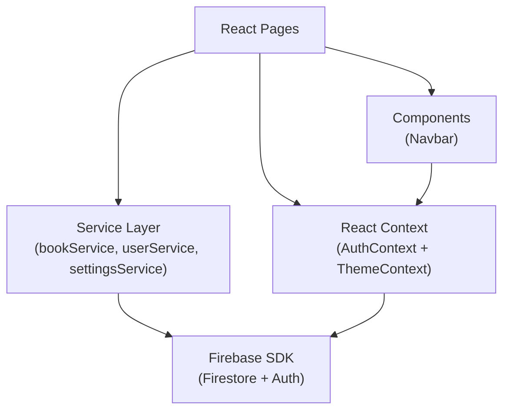
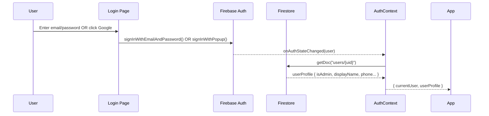
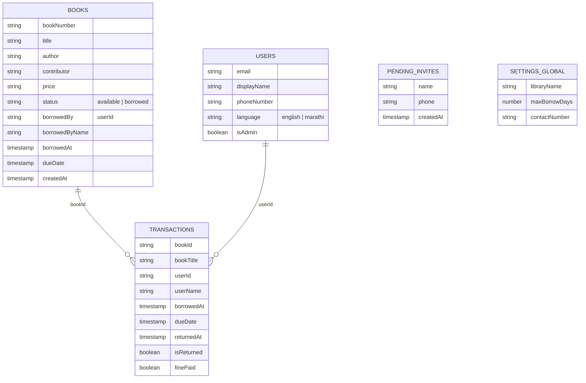
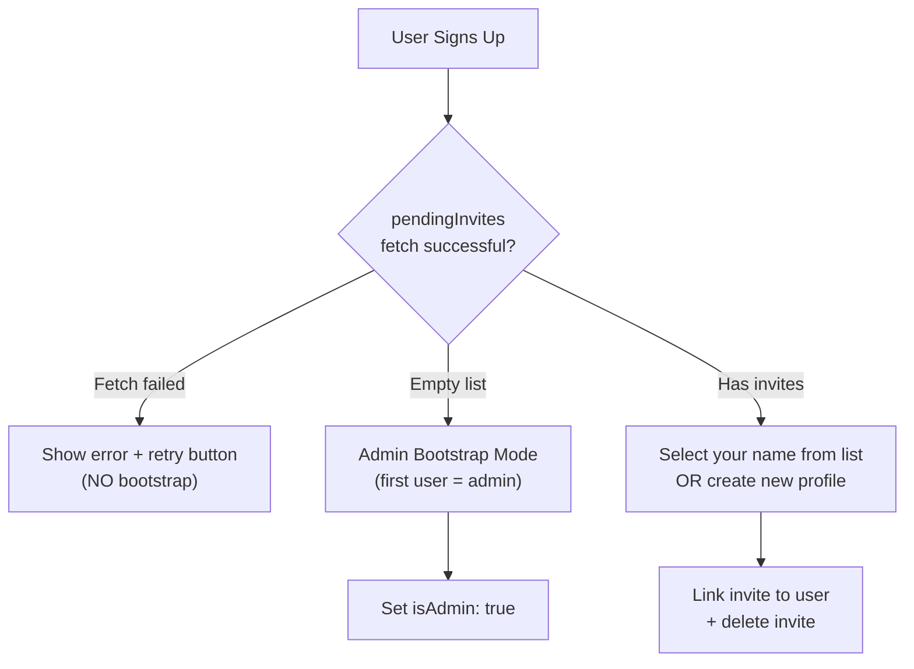

# 📚 Pustak Bhishi — Comprehensive Study Guide & Interview Prep

> **Purpose**: This document gives you total mastery of every architectural decision, every code pattern, and every feature in your Pustak Bhishi project — plus 100+ interview questions with model answers so you can defend every line on your resume.

---

## Table of Contents

1. [Project Overview — The 30-Second Pitch](#1-project-overview)
2. [Tech Stack Deep-Dive](#2-tech-stack-deep-dive)
3. [Architecture & File Structure](#3-architecture--file-structure)
4. [Firebase Integration (Auth + Firestore)](#4-firebase-integration)
5. [Authentication & RBAC System](#5-authentication--rbac)
6. [Firestore Data Model & Collections](#6-firestore-data-model)
7. [Service Layer Pattern](#7-service-layer)
8. [Page-by-Page Breakdown](#8-page-by-page-breakdown)
9. [Key Algorithms & Logic](#9-key-algorithms--logic)
10. [Deployment & DevOps (Vercel)](#10-deployment--devops)
11. [CSS Architecture & Theming](#11-css-architecture--theming)
12. [Utility Scripts](#12-utility-scripts)
13. [Interview Questions — Technical Deep Dives (100+)](#13-interview-questions)
14. [Weaknesses & How To Defend Them](#14-weaknesses--defenses)
15. [Quick Revision Cheat Sheet](#15-cheat-sheet)

---

## 1. Project Overview

### The 30-Second Pitch

> "Pustak Bhishi is a full-stack Library Management Application I built for a real Marathi book-sharing community of 19+ members managing 800+ books. It uses **React 19** with **Vite**, **Tailwind CSS v4**, and **Firebase** (Auth + Firestore). I deployed it on **Vercel** and it's live in production. The app supports role-based access — admins can bulk-import books from Excel, manage members, and track overdue fines, while members can browse the catalog, borrow/return books, and view their transaction history."

### What Makes This Project Stand Out (for resume)

| Talking Point | Why It Impresses |
|---|---|
| **Real users** (19+ members, 800+ books) | Not a toy project — production data |
| **Marathi metadata** from Excel | Handling Unicode/i18n in real-world data |
| **Role-based access (RBAC)** | Admin vs Member differentiation at route, UI, and data level |
| **Bulk Excel import with progress bar** | Client-side file parsing (SheetJS), async batch writes |
| **Firestore batched writes (500-doc chunking)** | Shows awareness of Firestore write limits |
| **Fine calculation at read-time** | Dynamic computation vs stored values — a real design decision |
| **Dark/Light theming via CSS custom properties** | System-preference detection + `localStorage` persistence |
| **Mobile-first responsive** | Separate mobile bottom-nav + desktop top-nav |
| **Deployed on Vercel** | CI/CD, SPA routing config (`vercel.json`) |
| **Admin bootstrap flow** | First user becomes admin automatically — zero-config first deployment |

---

## 2. Tech Stack Deep-Dive

### Frontend

| Technology | Version | Role |
|---|---|---|
| **React** | 19.2.4 | UI library (functional components + hooks) |
| **Vite** | 8.0.1 | Build tool & dev server (HMR, ESM-native) |
| **React Router** | 7.13.2 (v7) | Client-side routing with `<Routes>`, `<Route>`, `useNavigate`, `useLocation` |
| **Tailwind CSS** | 4.2.2 (v4) | Utility-first CSS via PostCSS plugin |

### Backend / BaaS

| Technology | Role |
|---|---|
| **Firebase Auth** | Email/password + Google OAuth sign-in |
| **Cloud Firestore** | NoSQL document database (real-time capable) |

### Tooling

| Technology | Role |
|---|---|
| **SheetJS (xlsx)** | Client-side Excel (.xlsx) parsing + CSV/XLSX generation |
| **PostCSS** | Tailwind's CSS processing pipeline |
| **ESLint** | Linting (react-hooks + react-refresh plugins) |
| **Vercel** | Static hosting with SPA fallback routing |

### Why These Choices? (Interview Ready)

- **Vite over CRA**: CRA is deprecated. Vite gives instant HMR, native ESM support, and smaller bundles.
- **Tailwind v4 over v3**: Uses the new PostCSS plugin approach (`@tailwindcss/postcss`), `@import "tailwindcss"` syntax — no more `@tailwind base/components/utilities`.
- **Firestore over SQL**: Schema-flexible NoSQL fits a book catalog where fields can be Marathi/English and vary per record. No migration headaches.
- **Firebase Auth over custom JWT**: Saves building login/signup/OAuth infrastructure from scratch. Battle-tested security.
- **SheetJS client-side over server-side**: No backend server needed — everything runs in the browser. The admin uploads Excel directly.
- **Vercel over Netlify/Firebase Hosting**: Vercel has zero-config Vite support + instant rollbacks + excellent DX.

---

## 3. Architecture & File Structure

```
Pustak_Bhishi/
├── src/
│   ├── main.jsx              ← React entry point (providers wrapped)
│   ├── App.jsx               ← Router + PrivateRoute component
│   ├── firebase.js           ← Firebase init (auth + db exports)
│   ├── index.css             ← CSS variables (light/dark) + Tailwind import
│   ├── App.css               ← Legacy Vite boilerplate (unused)
│   ├── context/
│   │   ├── AuthContext.jsx   ← Auth state, login/signup/logout, userProfile
│   │   └── ThemeContext.jsx  ← Dark/light mode toggle + localStorage
│   ├── services/
│   │   ├── bookService.js    ← All Firestore CRUD for books + transactions
│   │   ├── userService.js    ← User CRUD + pending invites
│   │   └── settingsService.js← Global library config CRUD
│   ├── components/
│   │   └── Navbar.jsx        ← Mobile bottom-nav + desktop top-nav
│   └── pages/
│       ├── Login.jsx         ← Email/password + Google OAuth login
│       ├── SetupProfile.jsx  ← First-time profile completion + admin bootstrap
│       ├── Dashboard.jsx     ← Member dashboard (borrows) + Admin dashboard (stats)
│       ├── Catalog.jsx       ← Book grid with search/filter + borrow modal
│       ├── MyBooks.jsx       ← Member's borrowed/history/contributed tabs
│       ├── Transactions.jsx  ← Admin-only: all transactions + CSV export
│       └── Settings.jsx      ← Mega settings hub (4 tabs: profile, books, members, config)
├── scripts/
│   ├── import_members.js     ← Seed pendingInvites from hardcoded list
│   ├── import_excel_invites.js ← Extract unique owners from Excel → invites
│   └── wipe_books.js         ← Delete all books + transactions (reset)
├── Data/
│   └── Book_Data_final.xlsx  ← Legacy 800-book Excel with Marathi headers
├── vercel.json               ← SPA fallback routing for Vercel
├── tailwind.config.js        ← Content paths for Tailwind purge
├── postcss.config.js         ← PostCSS with @tailwindcss/postcss
├── vite.config.js            ← Vite + React plugin
└── .env                      ← Firebase credentials (VITE_-prefixed)
```

### Architectural Pattern



> **Key pattern**: Pages never call Firestore directly — they go through the **service layer** (`services/*.js`). This is a clean **separation of concerns**.

---

## 4. Firebase Integration

### Initialization — [firebase.js](file:///c:/Chinmay/College/Projects/Pustak_Bhishi/src/firebase.js)

```javascript
const firebaseConfig = {
  apiKey: import.meta.env.VITE_FIREBASE_API_KEY,
  // ... all from .env
};

const app = initializeApp(firebaseConfig);
export const auth = getAuth(app);
export const db = getFirestore(app);
```

> [!IMPORTANT]
> **Interview point**: `import.meta.env.VITE_*` is Vite's way of exposing environment variables (only `VITE_`-prefixed vars are exposed to client code). This is different from CRA's `REACT_APP_*` prefix.

### Security Consideration

Firebase API keys are **not secret** — they identify the project but don't grant access. Security comes from **Firestore Security Rules** (server-side). The API key is safe to ship in the client bundle.

---

## 5. Authentication & RBAC

### Auth Flow — [AuthContext.jsx](file:///c:/Chinmay/College/Projects/Pustak_Bhishi/src/context/AuthContext.jsx)



### Key Implementation Details

1. **`onAuthStateChanged` listener** in `useEffect` subscribes to auth state changes. Returns an unsubscribe function for cleanup.

2. **userProfile** is fetched from Firestore (`users` collection) after auth, giving us custom fields like `isAdmin`, `displayName`, `phoneNumber`, `language`.

3. **`loading` state** prevents flash of unauthenticated content — children render only when `!loading`.

4. **`refreshProfile()`** can be called after profile updates to sync the context without a full page reload.

### Login Methods — [Login.jsx](file:///c:/Chinmay/College/Projects/Pustak_Bhishi/src/pages/Login.jsx)

| Method | Implementation |
|---|---|
| **Email/Password** | `signInWithEmailAndPassword(auth, email, password)` / `createUserWithEmailAndPassword` |
| **Google OAuth** | `signInWithPopup(auth, new GoogleAuthProvider())` |

> [!TIP]
> **Smart error handling**: If a user tries email login but their account is Google-only, the code calls `fetchSignInMethodsForEmail()` to detect this and shows a helpful message instead of "wrong password".

### Route Protection — [App.jsx](file:///c:/Chinmay/College/Projects/Pustak_Bhishi/src/App.jsx#L13-L31)

```jsx
function PrivateRoute({ children, requireAdmin }) {
  const { currentUser, userProfile } = useAuth();
  
  if (!currentUser) return <Navigate to="/login" />;
  
  // Force profile completion before anything else
  if (!isProfileComplete && location.pathname !== '/setup-profile')
    return <Navigate to="/setup-profile" />;
  
  // Admin-only gates
  if (requireAdmin && !userProfile?.isAdmin) return <Navigate to="/" />;
  
  return children;
}
```

### RBAC Summary

| Feature | Admin | Member |
|---|---|---|
| Dashboard view | Stats + overdue alerts + quick actions | My borrowed books + fine alerts |
| Browse catalog | ✅ + delete buttons | ✅ + borrow buttons |
| Borrow books | ✅ | ✅ |
| View transactions | All users' transactions | Only own |
| Bulk import from Excel | ✅ | ❌ |
| Manage members | ✅ | ❌ |
| Bulk delete books | ✅ | ❌ |
| Global settings | ✅ | ❌ |
| Settings page tabs | Profile + Books + Members + Config | Profile only |
| Navbar | Shows "Transactions" link | Shows "My Books" link |

---

## 6. Firestore Data Model

### Collections



### Key Design Decisions

1. **Denormalization**: `bookTitle` and `userName` are stored **both** in the transaction AND the book document. This is intentional NoSQL denormalization — avoids extra reads when listing transactions.

2. **Status on book document**: Instead of computing "is this borrowed?" by querying transactions, the `status` field on the book itself is updated. This makes catalog queries fast (`getDocs` with `orderBy("createdAt")`).

3. **Fine calculation at read-time**: The `attachFineCalculations()` helper in [bookService.js](file:///c:/Chinmay/College/Projects/Pustak_Bhishi/src/services/bookService.js#L21-L35) computes `daysBorrowed`, `isOverdue`, and `fineDue` **every time** transactions are fetched. This avoids stale stored fine values and ensures accuracy.

4. **Settings as a single document**: `settings/global` is one document, not a collection. This is the Firestore pattern for "global config" — cheap to read, easy to update with `setDoc(..., { merge: true })`.

---

## 7. Service Layer

### [bookService.js](file:///c:/Chinmay/College/Projects/Pustak_Bhishi/src/services/bookService.js) — The Heart of the App

| Function | Purpose | Key Firestore Operations |
|---|---|---|
| `addBook(data)` | Add a book | `addDoc` + `serverTimestamp()` |
| `getBooks()` | Get all books (ordered by newest) | `getDocs` + `orderBy("createdAt", "desc")` |
| `updateBook(id, data)` | Update a book | `updateDoc` |
| `deleteBook(id)` | Delete one book | `deleteDoc` |
| `bulkDeleteBooks(ids)` | Batch delete (500-chunked) | `writeBatch` → `batch.delete()` → `batch.commit()` |
| `borrowBook(bookId, ..., borrowDate)` | Borrow flow | `updateBook` (status→borrowed) + `addDoc` (transaction) |
| `returnBook(bookId, txnId)` | Return flow | `updateBook` (status→available) + `updateDoc` (isReturned=true, finePaid=true) |
| `getActiveTransactions(userId?)` | Get unreturned borrows | Compound query: `where("isReturned","==",false)` + fine calc |
| `getPastTransactions(userId)` | Get returned borrows for a user | `where("isReturned","==",true)` |
| `getAllTransactions()` | Admin: get everything | No filter, just `orderBy` + fine calc |

#### Batched Writes — 500-Document Chunking

```javascript
export async function bulkDeleteBooks(bookIds) {
  const chunks = [];
  for (let i = 0; i < bookIds.length; i += 500) {
    chunks.push(bookIds.slice(i, i + 500));
  }
  for (const chunk of chunks) {
    const batch = writeBatch(db);
    chunk.forEach((id) => batch.delete(doc(db, "books", id)));
    await batch.commit();
  }
}
```

> [!IMPORTANT]
> **Interview point**: Firestore limits batched writes to **500 operations per batch**. This code chunks the array to respect that limit. Always mention you know about this constraint.

#### Borrow Flow — Dual Write

```javascript
export async function borrowBook(bookId, bookTitle, userId, userName, borrowDate) {
  // 1. Update the book document (status → "borrowed")
  await updateBook(bookId, { status: "borrowed", borrowedBy: userId, ... });
  
  // 2. Create a transaction record
  return addDoc(collection(db, "transactions"), { bookId, bookTitle, ... });
}
```

> This is a **two-step write** — not atomic. If step 2 fails, the book is marked borrowed but no transaction exists. In a production system you'd use a Firestore batched write or Cloud Function. Acknowledge this tradeoff in interviews.

### [userService.js](file:///c:/Chinmay/College/Projects/Pustak_Bhishi/src/services/userService.js)

| Function | Purpose |
|---|---|
| `getAllUsers()` | Admin: list all registered users |
| `updateUserProfile(uid, data)` | Update Firestore doc + sync Firebase Auth `displayName` |
| `updateUserRole(uid, isAdmin)` | Toggle admin flag |
| `deleteUserDoc(uid)` | Delete Firestore profile (note: cannot delete Auth record from client SDK) |
| `addPendingInvite(name, phone)` | Create pre-registered member invite |
| `getPendingInvites()` | List all pending invites |
| `deletePendingInvite(id)` | Remove an invite (after user claims it) |

### [settingsService.js](file:///c:/Chinmay/College/Projects/Pustak_Bhishi/src/services/settingsService.js)

Simple CRUD for a single document (`settings/global`):
- `initializeGlobalSettings()` — creates defaults if document doesn't exist
- `getGlobalSettings()` — read
- `updateGlobalSettings(data)` — `setDoc` with `{ merge: true }`

---

## 8. Page-by-Page Breakdown

### 8.1 Login — [Login.jsx](file:///c:/Chinmay/College/Projects/Pustak_Bhishi/src/pages/Login.jsx)

**Features**:
- Toggle between Login / Register modes
- Google OAuth button
- Smart error messages (detects Google-only accounts)
- Responsive: mobile (single card) vs desktop (split-panel with branding)
- Loading states on buttons

**React Concepts Used**: `useState` for form state, `useNavigate` for redirect, `useAuth()` custom hook.

---

### 8.2 SetupProfile — [SetupProfile.jsx](file:///c:/Chinmay/College/Projects/Pustak_Bhishi/src/pages/SetupProfile.jsx)

**Purpose**: Forces first-time users to complete their profile before accessing the app.

**Three Scenarios**:



> [!IMPORTANT]
> **Interview point**: The admin bootstrap is elegant — the first user to sign up on a fresh database automatically becomes admin. But the code is careful: if the invite fetch *fails* (network error), it shows an error instead of bootstrapping — preventing accidental admin creation.

---

### 8.3 Dashboard — [Dashboard.jsx](file:///c:/Chinmay/College/Projects/Pustak_Bhishi/src/pages/Dashboard.jsx)

**Two completely different views** based on `userProfile.isAdmin`:

#### Member Dashboard
- Greeting with first name ("नमस्ते, Chinmay 🙏")
- Fine alert banner (red) if any book is overdue
- Grid of currently borrowed books with color-coded status (green/amber/red)
- Quick action: "Browse all books" link

#### Admin Dashboard
- 4 stat cards: Total books, Borrowed, Overdue (red), Fines pending (amber)
- "Needs Attention" feed (overdue transactions with one-click return)
- Quick action grid: Catalog, Members, Settings, Export

**React Pattern**: Conditional rendering via `{userProfile?.isAdmin ? <AdminDashboard /> : <MemberDashboard />}`

---

### 8.4 Catalog — [Catalog.jsx](file:///c:/Chinmay/College/Projects/Pustak_Bhishi/src/pages/Catalog.jsx)

**The biggest, most complex page. Features**:

1. **Search & Filter Bar**: Text search + status filter + donor/contributor filter
2. **Stats Header**: "X available · Y borrowed · Z total"
3. **Responsive Grid**: 2-col mobile → 3-col tablet → 4/5-col desktop
4. **BookCard component**: 
   - Color-coded accent bar (generated from title hash)
   - Initials badge (like Gmail)
   - Status pill (Available/Borrowed)
   - Overdue warning
   - CTA: "Borrow" (available), "Borrowed by you" (yours), "Borrowed by [name]" (others)
   - Admin: delete button overlay
5. **BorrowModal**: Date picker, auto-calculated due date, fine warning, confirm/cancel
6. **Toast notifications** for success/error feedback

#### Accent Color Algorithm — [getAccentColor()](file:///c:/Chinmay/College/Projects/Pustak_Bhishi/src/pages/Catalog.jsx#L8-L24)

```javascript
function getAccentColor(str = '') {
  // Hash the title string → pick from a 10-color palette
  let hash = 0;
  for (let i = 0; i < str.length; i++) 
    hash = str.charCodeAt(i) + ((hash << 5) - hash);
  return palettes[Math.abs(hash) % palettes.length];
}
```

> **Interview point**: This gives each book a **deterministic, stable** color based on its title. Same title always = same color. No randomness. No stored color field.

---

### 8.5 MyBooks — [MyBooks.jsx](file:///c:/Chinmay/College/Projects/Pustak_Bhishi/src/pages/MyBooks.jsx)

**Three tabs**:
1. **Currently Borrowed**: Active loans with return button + overdue tags
2. **History**: Past returns with "✓ On time" or "⚠ Late" badges
3. **Contributed**: Books donated by this user (matched by `displayName` vs `book.contributor`)

**Lazy Loading**: History tab data is only fetched when the user clicks on it (not on mount).

```javascript
useEffect(() => {
  if (activeTab === 'history' && history.length === 0 && !historyLoading) {
    fetchHistory();
  }
}, [activeTab]);
```

---

### 8.6 Transactions — [Transactions.jsx](file:///c:/Chinmay/College/Projects/Pustak_Bhishi/src/pages/Transactions.jsx) (Admin Only)

**Features**:
- Guard: `if (!userProfile?.isAdmin) return <Navigate to="/" />`
- Stats bar: Active, Overdue, Fines Pending, Returned
- Search + status filter
- **Desktop**: Full data table with 8 columns
- **Mobile**: Card-based list
- **CSV Export**: Client-side CSV generation using `Blob` + `URL.createObjectURL` + programmatic click
- Admin can "Mark Returned" or "Return + Clear Fine" directly

#### CSV Export Implementation

```javascript
function exportCSV(transactions) {
  const headers = ['Book Title', 'Member', 'Borrowed On', ...];
  const rows = transactions.map(txn => [...].join(','));
  const csv = [headers.join(','), ...rows].join('\n');
  const blob = new Blob([csv], { type: 'text/csv;charset=utf-8;' });
  const url = URL.createObjectURL(blob);
  // Trigger download...
}
```

---

### 8.7 Settings — [Settings.jsx](file:///c:/Chinmay/College/Projects/Pustak_Bhishi/src/pages/Settings.jsx)

**The largest file (1038 lines)**. A multi-tab settings hub:

#### Tab 1: Profile (All Users)
- Edit display name, phone, language preference (English/Marathi)
- Theme switcher (Light/Dark)
- Security: Change password OR add password (for Google-only users via `linkWithCredential`)
- Borrow history
- About section with WhatsApp contact link
- **Danger Zone**: Delete account (with active borrow check!)

#### Tab 2: Manage Books (Admin)
- **Bulk Excel Import**: The crown jewel feature
  - Uses SheetJS to parse `.xlsx` client-side
  - Auto-detects Marathi headers (`नंबर`, `पुस्तकाचे नाव`, `लेखकाचे नाव`, `कोणाची भिशी`, `किंमत`)
  - Uploads books one-by-one with progress bar
  - Skips duplicate serial numbers
  - Auto-creates pending invites from unique contributor names
- **Add Single Book**: Form for manual entry with duplicate number check
- **Active Borrows**: Process returns from admin panel
- **Library Catalog (Bulk Manage)**: Searchable list with checkboxes + bulk delete

#### Tab 3: Members (Admin)
- Registered member list with per-member stats (donated count, borrowed count, active borrows)
- Actions: Reset Password, Toggle Admin, Remove
- Pending invites: Add new, view list, delete

#### Tab 4: Global Config (Admin)
- Library name, max borrow days, admin WhatsApp number
- Data export (transactions to `.xlsx`)

---

## 9. Key Algorithms & Logic

### 9.1 Fine Calculation — Read-Time Computation

```javascript
function attachFineCalculations(data) {
  if (!data.borrowedAt || data.isReturned || data.finePaid) {
    return { ...data, daysBorrowed: 0, isOverdue: false, fineDue: 0 };
  }
  const borrowedDate = data.borrowedAt.toDate ? data.borrowedAt.toDate() : new Date(data.borrowedAt);
  const diffTime = new Date() - borrowedDate;
  const daysBorrowed = Math.floor(diffTime / (1000 * 60 * 60 * 24)); 
  const isOverdue = daysBorrowed > 90;
  const fineDue = isOverdue ? 20 : 0;
  return { ...data, daysBorrowed, isOverdue, fineDue };
}
```

**Why read-time?** If you stored the fine, you'd have to run a nightly cron to update all active transactions. Read-time calculation means the fine is always **instantly accurate** with zero background jobs.

### 9.2 Excel Import — Header Detection for Marathi

```javascript
const titleIdx = headers.findIndex(h => 
  h.includes('नाव') || h.includes("name") || h.includes("title")
);
const authorIdx = headers.findIndex(h => 
  h.includes('लेखक') || h.includes("author")
);
```

The parser looks for **both Marathi and English** header variants, making it flexible for different Excel formats.

### 9.3 Firestore Timestamp Handling

The codebase handles **two timestamp formats** gracefully:

```javascript
const d = value?.toDate ? value.toDate() : new Date(value);
```

- Firestore `Timestamp` objects have a `.toDate()` method
- JSON-serialized timestamps are plain strings
- This pattern handles both without crashing

### 9.4 SPA Routing on Vercel

```json
// vercel.json
{
  "routes": [
    { "handle": "filesystem" },
    { "src": "/(.*)", "dest": "/index.html" }
  ]
}
```

**Why needed?** In a SPA, all routes (like `/books`, `/settings`) must fall back to `index.html` so React Router can handle them. Without this, direct URL access or refresh on `/books` returns 404.

---

## 10. Deployment & DevOps

### Vercel Deployment

- **Build command**: `vite build` (outputs to `dist/`)
- **SPA fallback**: `vercel.json` catches all routes
- **Environment variables**: Set in Vercel dashboard (not committed)
- **Preview deployments**: Every push gets a unique URL

### Environment Variables

All Firebase config vars are `VITE_`-prefixed so Vite exposes them:
```
VITE_FIREBASE_API_KEY=...
VITE_FIREBASE_AUTH_DOMAIN=...
VITE_FIREBASE_PROJECT_ID=...
VITE_FIREBASE_STORAGE_BUCKET=...
VITE_FIREBASE_MESSAGING_SENDER_ID=...
VITE_FIREBASE_APP_ID=...
```

---

## 11. CSS Architecture & Theming

### Design System — [index.css](file:///c:/Chinmay/College/Projects/Pustak_Bhishi/src/index.css)

Uses **CSS custom properties** for theming:

```css
:root {
  --bg-app: #f4f5f7;
  --bg-surface: #ffffff;
  --text-primary: #14161a;
  /* ... */
}

.dark {
  --bg-app: #121212;
  --bg-surface: #1a1a1a;
  --text-primary: #ffffff;
  /* ... */
}
```

### Theme Toggle — [ThemeContext.jsx](file:///c:/Chinmay/College/Projects/Pustak_Bhishi/src/context/ThemeContext.jsx)

1. **Initial theme**: Check `localStorage`, fall back to `prefers-color-scheme` media query
2. **Toggle**: Adds/removes `.dark` class on `<html>` element
3. **Persistence**: Saves to `localStorage` under key `pb-theme`

### Tailwind v4 Setup

```css
@import "tailwindcss";
@custom-variant dark (&:where(.dark, .dark *));
```

> **Interview point**: This is Tailwind v4 syntax — no more `@tailwind base;` directives. The `@custom-variant dark` line enables `dark:` utilities to work with the `.dark` class strategy (instead of `prefers-color-scheme`).

---

## 12. Utility Scripts

### [import_members.js](file:///c:/Chinmay/College/Projects/Pustak_Bhishi/scripts/import_members.js)
Seeds 19 hardcoded members into `pendingInvites`. Checks for duplicates by phone number before inserting.

### [import_excel_invites.js](file:///c:/Chinmay/College/Projects/Pustak_Bhishi/scripts/import_excel_invites.js)
Reads `Book_Data_final.xlsx`, extracts unique owner/contributor names, creates `pendingInvites` for each (skipping existing names).

### [wipe_books.js](file:///c:/Chinmay/College/Projects/Pustak_Bhishi/scripts/wipe_books.js)
Nuclear option — deletes all documents from `books` and `transactions` collections. Uses 500-doc chunked batches. Useful for database reset during development.

> All scripts parse `.env` manually (no `dotenv` dependency) and use Firebase client SDK directly.

---

## 13. Interview Questions

### Section A: Project Overview & Motivation (10 Questions)

---

**Q1: Walk me through your Pustak Bhishi project in 60 seconds.**

> "Pustak Bhishi is a full-stack Library Management Application I built for a real Marathi book-sharing community. It manages 800+ books with Marathi metadata support. The frontend is React 19 with Vite and Tailwind CSS v4. The backend is entirely Firebase — Auth for authentication and Firestore for the database. I implemented role-based access: admins can bulk-import books from Excel files with Marathi headers, manage members, track overdue fines, and export data. Members can browse the catalog, borrow and return books, and view their transaction history. It's deployed on Vercel and currently live in production."

---

**Q2: Why did you build this project? What problem does it solve?**

> "This was built for a real community — a group of women who share Marathi books through a 'bhishi' (a rotational contributing pool). Before this app, they tracked everything manually on paper and WhatsApp. The app digitized their catalog, automated borrow/return tracking, calculates fines automatically, and lets the admin import their existing 800-book Excel spreadsheet directly."

---

**Q3: What was the most challenging part of building this?**

> "The Excel import feature. The legacy spreadsheet had Marathi headers like `पुस्तकाचे नाव` and `लेखकाचे नाव`. I had to write fuzzy header detection that works with both Marathi and English column names, handle duplicate serial numbers across imports, show a real-time progress bar during the upload, and auto-generate member invites from the contributor column — all client-side without any backend server."

---

**Q4: How many users does this app serve currently?**

> "19+ active members plus an admin. The catalog has 800+ books. It's a real production deployment — members use it to borrow and return books."

---

**Q5: Why did you choose Firebase over building your own backend?**

> "For this project's scale — ~20 users, ~800 documents — Firebase is perfect. I get authentication, database, and hosting without maintaining a server. Firestore's real-time capabilities, offline support, and generous free tier made it the right choice. If the app needed complex server-side logic like email notifications or payment processing, I'd add Cloud Functions."

---

**Q6: If you were to rebuild this project from scratch, what would you do differently?**

> "Three things: (1) I'd make the borrow/return flow atomic using Firestore transactions instead of two separate writes. (2) I'd add Firestore Security Rules to enforce RBAC at the database level, not just the UI. (3) I'd add pagination to the catalog instead of loading all 800 books at once — using Firestore cursors with `startAfter()`."

---

**Q7: How did you handle the requirement for Marathi language support?**

> "At two levels. First, the Excel import engine detects Marathi column headers like `नंबर`, `पुस्तकाचे नाव`, `लेखकाचे नाव` using `includes()` matching. Second, the UI has a language preference (English/Marathi) stored in the user's profile, and the Navbar labels switch accordingly using a translation object."

---

**Q8: What security measures have you implemented?**

> "Firebase Auth handles password hashing and session management. Route protection via `PrivateRoute` prevents unauthenticated access. Admin routes check `userProfile.isAdmin`. The profile setup flow prevents users from accessing the app without completing their profile. Account deletion checks for active borrows first. Google OAuth users can link a password for backup access."

---

**Q9: Is this app currently deployed? How can I access it?**

> "Yes, it's live on Vercel. The `vercel.json` file configures SPA routing so all paths fall back to `index.html` for React Router to handle. Environment variables for Firebase are set in the Vercel dashboard."

---

**Q10: What's the difference between your admin and member experience?**

> "They see completely different dashboards. Members see their borrowed books, fine alerts, and can browse/borrow from the catalog. Admins see aggregate stats (total books, overdue count, pending fines), a 'Needs Attention' feed of overdue books, and quick actions for catalog, members, and settings management. The Settings page shows 4 tabs for admins vs 1 tab for members."

---

### Section B: React & Frontend (20 Questions)

---

**Q11: Explain the component hierarchy of your app.**

> "`main.jsx` wraps everything in providers: `ThemeProvider` → `BrowserRouter` → `AuthProvider` → `App`. Inside `App`, there's a `Navbar` component and `Routes` with 7 routes. Each route is wrapped in `PrivateRoute` for auth protection."

---

**Q12: Why did you use React Context instead of Redux or Zustand?**

> "The app has only two pieces of global state: auth (user + profile) and theme (dark/light). Context is perfect for this — no need for the boilerplate of Redux. If the app grew to need complex state with many consumers, I'd consider Zustand for its simplicity."

---

**Q13: How does your `PrivateRoute` component work?**

> "It checks three things in order: (1) Is there a `currentUser`? If not → redirect to `/login`. (2) Is the profile complete (has `displayName` and `phoneNumber`)? If not → redirect to `/setup-profile`. (3) If `requireAdmin` prop is true, is the user an admin? If not → redirect to `/`. Only then does it render `children`."

---

**Q14: Why do you have `{!loading && children}` in AuthContext instead of a loading spinner?**

> "Firebase's `onAuthStateChanged` is asynchronous — there's a brief moment on page load where `currentUser` is null even if the user is logged in. Without the `loading` gate, `PrivateRoute` would flash a redirect to `/login` before auth state resolves. The loading flag prevents this."

---

**Q15: Explain the `useMemo` usage in your Catalog page.**

> "I use `useMemo` for the donor filter dropdown to avoid recalculating the unique donor list on every render. The donor names are extracted from all books, deduplicated, and memoized — only recomputed when the `books` array reference changes."

---

**Q16: How do you handle search and filtering in the Catalog?**

> "I maintain `searchQuery`, `statusFilter`, and `donorFilter` as state. The `applyFilters()` function runs all three filters against the `books` array using `.filter()` with chained conditions. The search checks across `title`, `author`, `contributor`, and `bookNumber` fields."

---

**Q17: Why separate state for `books` and `filteredBooks`?**

> "`books` holds the full dataset from Firestore. `filteredBooks` holds the currently displayed subset after applying search/filters. This way, resetting filters just sets `filteredBooks = books` without re-fetching from Firestore."

---

**Q18: How does your toast notification system work?**

> "I use local component state: `setToast({ msg, type })` sets the message, and `setTimeout(() => setToast(null), 3500)` auto-dismisses it after 3.5 seconds. The toast renders as a fixed-position element at the top of the viewport with conditional styling based on `type` (success = green, error = red)."

---

**Q19: Explain the BorrowModal component.**

> "It's a controlled modal with a date picker and auto-calculated due date (borrow date + 90 days). The due date uses `useMemo` and recalculates whenever `borrowDate` changes. It shows the accent color from the book's title hash and includes a fine warning. The modal uses `position: fixed` with a backdrop blur overlay."

---

**Q20: How do you handle tab navigation in MyBooks and Settings?**

> "`activeTab` state determines which tab content renders via conditional rendering. Tabs are rendered as buttons with active/inactive styling. In Settings, the tab can also be set via URL query parameter (`?tab=members`), synced using `useLocation` and `URLSearchParams`."

---

**Q21: Why do you lazy-load the History tab in MyBooks?**

> "Performance optimization. Most users open MyBooks to see their current borrows. Loading all past transactions on mount would mean an extra Firestore query that might not be needed. The history is fetched only when the user clicks the History tab."

---

**Q22: How does the theme toggle work end-to-end?**

> "The `ThemeContext` manages a `theme` state ('light' or 'dark'). On change, it toggles the `.dark` class on `document.documentElement` and saves to `localStorage`. CSS uses custom properties (`:root` for light, `.dark` for dark). On initial load, it checks `localStorage` first, then falls back to `prefers-color-scheme` media query."

---

**Q23: Explain your mobile vs desktop navigation approach.**

> "Two completely separate navbars: a mobile bottom-nav (`position: fixed; bottom: 0`) visible on `md:hidden`, and a desktop top-nav (`hidden md:block; position: sticky; top: 0`). They show different icons and labels. Admin sees 'Transactions' while members see 'My Books' in the third slot."

---

**Q24: How do you generate book initials and accent colors?**

> "Initials: I split the title by spaces, filter words shorter than 3 characters, take the first 2 words, and use their first letters. Accent color: I hash the title string using `charCodeAt` to produce a number, then modulo into a 10-color palette. The hash is deterministic — same title always produces the same color."

---

**Q25: What React hooks do you use and where?**

| Hook | Usage |
|---|---|
| `useState` | Every page — form inputs, loading states, fetched data |
| `useEffect` | Data fetching on mount, auth state listener, tab changes |
| `useContext` (via `useAuth`, `useTheme`) | Access global auth/theme state |
| `useMemo` | Catalog: donor list, Transactions: filtered list + stats |
| `useNavigate` | Redirect after login/logout/profile setup |
| `useLocation` | Active route highlighting, Settings tab from query params |

---

**Q26: How does the responsive grid work in the Catalog?**

> "Tailwind classes: `grid grid-cols-2 gap-3 sm:grid-cols-3 lg:grid-cols-4 xl:grid-cols-5`. This gives 2 columns on mobile, 3 on small screens, 4 on large, and 5 on extra large. Each `BookCard` uses `flex-col` internally for vertical layout."

---

**Q27: How do you handle error states in the application?**

> "Multiple strategies: (1) Try/catch in async functions with `console.error` + user-facing alerts or toasts. (2) Dedicated error state in MyBooks that shows a Firestore index creation helper. (3) Login page has per-error-code messages (wrong password, email in use, weak password). (4) SetupProfile distinguishes between 'fetch failed' and 'empty list' to prevent accidental admin bootstrap."

---

**Q28: Why do you use `window.confirm()` for destructive actions?**

> "Quick implementation for MVP. In production, I'd use a custom modal component for a better UX. But `window.confirm` guarantees the user explicitly acknowledges destructive actions like deleting books, returning books, or deleting accounts."

---

**Q29: How does the Marathi/English language switch work in the Navbar?**

> "The user's language preference is stored in their Firestore profile as `language: 'english' | 'marathi'`. The Navbar reads `userProfile.language` and uses a translation object `t` with keys like `home`, `books`, `myBooks` etc. Each key has English and Marathi values."

---

**Q30: Explain how the `PrivateRoute` enforces profile completion.**

> "After authentication, `PrivateRoute` checks if `userProfile.displayName && userProfile.phoneNumber` are truthy. If not, it redirects to `/setup-profile`. The SetupProfile page itself is also wrapped in `PrivateRoute` but is exempted from the profile-complete check via `location.pathname !== '/setup-profile'`."

---

### Section C: Firebase & Backend (20 Questions)

---

**Q31: Explain your Firestore data model.**

> "Four collections plus one singleton document. `books` stores the catalog with status tracking. `transactions` logs every borrow/return event. `users` stores profile data and admin flag. `pendingInvites` holds pre-registered members. `settings/global` is a single document for library-wide config."

---

**Q32: Why did you choose Firestore over Realtime Database?**

> "Firestore supports complex queries (compound where, orderBy), has automatic indexing, scales better, and has a more structured document model. Realtime Database is better for simple data syncing but harder to query."

---

**Q33: How do Firestore compound queries work in your transaction fetching?**

> "For active transactions of a user, I query: `where('userId', '==', uid)` AND `where('isReturned', '==', false)` AND `orderBy('borrowedAt', 'desc')`. This requires a Firestore composite index, which I create in the Firebase console. My MyBooks page even has an error handler that displays the index creation URL if the query fails."

---

**Q34: Explain the difference between `serverTimestamp()` and `Timestamp.fromDate()`.**

> "`serverTimestamp()` is a sentinel that tells Firestore to use the server's clock when the write happens — prevents clock skew from the client. `Timestamp.fromDate(new Date())` creates a timestamp from the client's clock. I use `serverTimestamp()` for `createdAt` and `returnedAt` (truth-source events) but `Timestamp.fromDate()` for custom borrow dates (user-selected dates)."

---

**Q35: How do Firestore batched writes work and why do you chunk at 500?**

> "A `writeBatch` groups multiple write operations into a single atomic commit — all succeed or all fail. Firestore limits each batch to 500 operations. My `bulkDeleteBooks` function chunks the ID array into groups of 500, creates a batch per chunk, and commits them sequentially."

---

**Q36: What are Firestore Security Rules and do you have them?**

> "Security Rules are server-side access control for Firestore — they determine who can read/write what data. Currently, my app enforces RBAC at the UI/code level (checking `isAdmin` before showing admin features). For production hardening, I'd add rules like: only authenticated users can read `books`, only admins can write to `books`, users can only read their own transactions."

---

**Q37: How does Firebase Auth work with your Firestore user profiles?**

> "Firebase Auth handles authentication (login/signup/session). But it only stores basic info (email, uid). My app creates a parallel document in the `users` Firestore collection for custom fields like `displayName`, `phoneNumber`, `isAdmin`, and `language`. The `AuthContext` fetches this profile after auth state confirms."

---

**Q38: How does Google OAuth integration work?**

> "I use `signInWithPopup(auth, new GoogleAuthProvider())`. Firebase handles the OAuth flow entirely — redirect to Google, get consent, receive token, create Firebase user. On the app side, after Google login, the user lands on SetupProfile to claim their pending invite. For Google-only users, Settings offers `linkWithCredential()` to add an email/password login as backup."

---

**Q39: Why do you use `setDoc` with `merge: true` instead of `updateDoc`?**

> "`updateDoc` fails if the document doesn't exist. `setDoc` with `merge: true` creates the document if it doesn't exist and merges fields if it does. I use this for `updateUserProfile` because a new Google OAuth user might not have a Firestore profile doc yet."

---

**Q40: How would you add Firestore Security Rules to this project?**

> "I'd write rules in `firestore.rules` like:
> ```
> match /books/{bookId} {
>   allow read: if request.auth != null;
>   allow write: if get(/databases/$(database)/documents/users/$(request.auth.uid)).data.isAdmin == true;
> }
> match /users/{userId} {
>   allow read: if request.auth.uid == userId || get(...).data.isAdmin == true;
>   allow write: if request.auth.uid == userId;
> }
> ```"

---

**Q41: How do you handle the limitation that client SDK can't delete Auth users?**

> "I acknowledge it. The `deleteUserDoc` function only deletes the Firestore profile. The comment in the code says 'requires Cloud Functions for full deletion.' If asked, I'd explain that Firebase Admin SDK (server-side only) has `admin.auth().deleteUser(uid)`, which I'd trigger via a Cloud Function."

---

**Q42: What happens if the borrow/return flow fails midway?**

> "Currently, `borrowBook` does two separate writes: update the book status, then create a transaction. If the second write fails, the book shows as 'borrowed' with no transaction record — an inconsistent state. The fix would be using `writeBatch` to make both writes atomic."

---

**Q43: How does your fine calculation work?**

> "Fines are calculated at read-time, not stored. When transactions are fetched, `attachFineCalculations()` computes the number of days since `borrowedAt`, checks if it exceeds 90 days, and assigns a flat ₹20 fine if overdue. This means fines are always accurate without any background jobs."

---

**Q44: Why didn't you use Firestore's real-time listeners (`onSnapshot`)?**

> "I used `getDocs` (one-time reads) because the data update frequency is low — books are borrowed/returned maybe a few times a day. Real-time listeners would keep a WebSocket connection open and consume more reads. For this use case, fetching on page load and after actions is more efficient."

---

**Q45: How do you handle Firestore Timestamps in the UI?**

> "I use a helper pattern: `const d = value?.toDate ? value.toDate() : new Date(value)`. Firestore Timestamps have a `.toDate()` method, but sometimes data comes as serialized strings. This pattern handles both. I then format with `toLocaleDateString('en-IN', { day: 'numeric', month: 'short', year: 'numeric' })`."

---

**Q46: What Firestore read/write patterns does your app use?**

> - `getDocs(query(...))` — Batch reads with filtering
> - `getDoc(doc(db, ...))` — Single document reads (user profile, settings)
> - `addDoc(collection(...), data)` — Auto-ID document creation (books, transactions, invites)
> - `updateDoc(doc(...), data)` — Partial update (return book, toggle admin)
> - `setDoc(doc(...), data, { merge: true })` — Create-or-merge (profile, settings)
> - `deleteDoc(doc(...))` — Single delete
> - `writeBatch(db)` — Bulk atomic operations (bulk delete)

---

**Q47: How do you handle the VITE_ prefix for environment variables?**

> "Vite only exposes environment variables prefixed with `VITE_` to the client bundle via `import.meta.env`. This is a security measure — server-only secrets without the prefix aren't bundled. All my Firebase config vars use `VITE_FIREBASE_*` naming."

---

**Q48: What indexes does your Firestore database need?**

> "Composite indexes for compound queries:
> 1. `transactions`: `userId` + `isReturned` + `borrowedAt` (for user's active borrows)
> 2. `transactions`: `userId` + `isReturned` + `returnedAt` (for user's history)
> 3. `transactions`: `isReturned` + `borrowedAt` (for admin's active borrows)
>
> Firebase auto-creates single-field indexes but composite ones must be created manually."

---

**Q49: How does the pending invites system work?**

> "The admin pre-registers members by adding their name and phone to `pendingInvites`. When a new user signs up and lands on SetupProfile, they see a list of pending invites and select their name. This links their Firebase Auth account to the pre-registered identity. The invite is then deleted from the collection."

---

**Q50: How does `linkWithCredential` work for Google users?**

> "If a user signed in with Google (no password), they can add email/password login via Settings. The code creates an `EmailAuthProvider.credential(email, password)` and calls `linkWithCredential(currentUser, credential)`. This links the password method to their existing Google account, so they can sign in either way."

---

### Section D: Specific Feature Deep-Dives (15 Questions)

---

**Q51: Walk me through the Excel import flow step by step.**

> 1. Admin clicks 'Choose Excel File' — triggers `<input type="file">`
> 2. `FileReader.readAsArrayBuffer(file)` reads the binary data
> 3. SheetJS `xlsx.read(data, { type: 'array' })` parses it into a workbook
> 4. `sheet_to_json(worksheet, { header: 1 })` gives raw 2D array
> 5. Header detection: find the first row with string data, then fuzzy-match Marathi/English column names
> 6. For each data row:
>    - Skip empty rows and duplicate serial numbers
>    - Create a book document via `addBook()`
>    - Update progress bar
> 7. Extract unique contributor names → create `pendingInvites` for new ones
> 8. Show final summary message

---

**Q52: How does the admin bootstrap work on first deployment?**

> "When the first user signs up and reaches SetupProfile, the code fetches `pendingInvites`. If the collection is empty (fresh database), it shows the 'System Bootstrap' UI. The user enters their name and phone, and `handleManualBootstrap` saves their profile with `isAdmin: true`. Crucially, if the invite fetch *fails* (network error), it shows an error — never falls through to bootstrap. This prevents accidental admin creation."

---

**Q53: How does bulk deletion work?**

> "Admin selects books via checkboxes (stored in `selectedIds` state). 'Select All' toggles the entire filtered list. On clicking 'Delete Selected', `executeBulkDelete()` calls `bulkDeleteBooks(selectedIds)` which chunks the IDs into groups of 500 and uses `writeBatch` for each chunk. After completion, it reloads the admin data."

---

**Q54: How does the CSV/XLSX export work?**

> "Two export formats: CSV in Transactions page (manual string concatenation + Blob download), and XLSX in Settings (using SheetJS: `xlsx.utils.json_to_sheet()` → `xlsx.utils.book_new()` → `xlsx.writeFile()`). Both generate files client-side without any server."

---

**Q55: How does the 'Contributed Books' tab determine which books belong to a user?**

> "It matches `book.contributor.trim().toLowerCase()` against `userProfile.displayName.trim().toLowerCase()`. This is a name-based match, not an ID-based match — meaning it works even for books imported before the user registered."

---

**Q56: How does the overdue warning system work visually?**

> "Three tiers based on `daysBorrowed`:
> - **Green** (✅ X days left): `daysBorrowed < 80`
> - **Amber** (⚠️ Due in X days): `80 < daysBorrowed < 90`
> - **Red** (🔴 Overdue by X days, ₹20 fine): `daysBorrowed > 90`
>
> This color-coding appears on Dashboard cards, MyBooks transaction cards, and Catalog book cards."

---

**Q57: How does the account deletion feature protect against data loss?**

> "Before deleting, it fetches `getActiveTransactions(currentUser.uid)`. If the user has any unreturned books, it blocks deletion with an alert. Only after all books are returned can the account be deleted. It also requires recent authentication (`auth/requires-recent-login` handling)."

---

**Q58: How does the Settings page use URL query parameters?**

> "`const queryParams = new URLSearchParams(location.search)` reads `?tab=members` from the URL. This means the admin Dashboard's 'All Members' quick action links to `/settings?tab=members`, opening Settings directly on the Members tab."

---

**Q59: How does the duplicate serial number check work during import?**

> "Before import, it collects all existing book numbers: `const existingBookNumbers = new Set(adminBooks.map(b => b.bookNumber))`. For each row, if the parsed number already exists in this Set, it increments `skippedCount` and continues. It also adds newly imported numbers to the Set to prevent intra-file duplicates."

---

**Q60: How does the progress bar during Excel import work?**

> "`importProgress` state (0-100) is updated after each book is successfully added: `setImportProgress(Math.round((importedCount / dataRows.length) * 100))`. The progress bar is a div with `width: ${importProgress}%` and a CSS transition for smooth animation."

---

**Q61: How does the borrow date picker work?**

> "The BorrowModal has a date input defaulting to today (`new Date().toISOString().split('T')[0]`). The `max` attribute is set to today's date so users can't set a future borrow date. The due date auto-recalculates (borrow date + 90 days) using `useMemo` dependent on `borrowDate`."

---

**Q62: Explain the member card in the admin Members tab.**

> "Each member card shows: display name, phone, email, role badge (Admin/Member), donated book count (matched by name), active borrow count, list of currently borrowed books with their donor name, and action buttons (Reset Password, Toggle Admin, Remove). The donated/borrowed counts are calculated by cross-referencing `adminBooks` and `adminTxns`."

---

**Q63: How does the 'About' section show admin contact?**

> "The `contactNumber` from `settings/global` is formatted into a WhatsApp link: `https://wa.me/${contactNumber.replace(/\D/g, '')}`. The `.replace(/\D/g, '')` strips non-digit characters (spaces, dashes) from the phone number."

---

**Q64: How does the password reset for members work?**

> "Admin clicks 'Reset Pass' → `sendPasswordResetEmail(auth, email)`. Firebase sends an email with a password reset link directly. The admin doesn't need to know or set the new password."

---

**Q65: How do you handle the 'returned on time' vs 'returned late' distinction?**

> "In Transactions page, `getStatus(txn)` compares `returnedAt` to `dueDate`. If `returnedDate <= dueDate` → 'on-time' (green badge). Otherwise → 'late' (amber badge). For active unreturned books, it checks `isOverdue` flag from `attachFineCalculations`."

---

### Section E: Deployment, Performance & Production (10 Questions)

---

**Q66: How does your Vercel deployment work?**

> "Vercel auto-detects Vite and runs `vite build`. The output goes to `dist/`. The `vercel.json` configures SPA routing: first try the filesystem (for static assets like JS/CSS), then fall back all routes to `index.html` for React Router."

---

**Q67: What happens when a user directly navigates to `/books` on Vercel?**

> "Without `vercel.json`, Vercel would return 404 because there's no physical `books/index.html`. The SPA fallback rule `{ src: '/(.*)', dest: '/index.html' }` catches this and serves `index.html`, where React Router picks up the URL and renders the Catalog component."

---

**Q68: How would you optimize performance for 800+ books?**

> "Currently, all 800 books are loaded at once. I'd implement: (1) **Pagination** using Firestore cursors (`startAfter(lastDoc)`, `limit(50)`). (2) **Virtual scrolling** with `react-window` to only render visible cards. (3) **Firestore's `select()` field mask** to only fetch needed fields for the card view."

---

**Q69: What's the estimated Firestore cost for this app?**

> "Very low. Firebase's free Spark plan allows 50K reads/day and 20K writes/day. With 20 users browsing maybe 5-10 times a day, that's ~200 book-list reads + ~50 transaction reads. Well under free tier. The most expensive operation is the Excel import (800 writes), but that's a one-time admin action."

---

**Q70: How do you handle environment variables between local and production?**

> "Locally: `.env` file in project root with `VITE_FIREBASE_*` vars. In production: Environment variables set in Vercel's dashboard (Project → Settings → Environment Variables). The `.env` file is in `.gitignore` so credentials aren't committed."

---

**Q71: What would you do if the app needed to support 10,000 books?**

> "Three changes: (1) Server-side pagination with Firestore cursors. (2) Debounced search with server-side filtering (`where('title', '>=', searchTerm)`) instead of loading all books then filtering in-memory. (3) Consider Algolia or Firebase Extensions for full-text search, since Firestore has limited text search capabilities."

---

**Q72: How would you add offline support?**

> "Firestore has built-in offline persistence. I'd enable it with `enableIndexedDbPersistence(db)`. The SDK caches documents locally and syncs when online. For the UI, I'd add an offline indicator and disable write operations when `navigator.onLine` is false."

---

**Q73: What monitoring or error tracking do you have?**

> "Currently, `console.error` for development. For production, I'd add: (1) Firebase Crashlytics or Sentry for error tracking. (2) Firebase Analytics for usage metrics. (3) Vercel's built-in Web Analytics for performance monitoring."

---

**Q74: How does the build output look?**

> "Vite produces a `dist/` folder with hashed filenames for cache-busting (`index-abc123.js`). Assets are automatically split. The total bundle is small because there's no heavy UI library — just React + React Router + Firebase SDK + SheetJS."

---

**Q75: How would you implement CI/CD beyond Vercel?**

> "Vercel already gives CI/CD: every push triggers a build + deploy. For testing, I'd add GitHub Actions with: (1) ESLint check. (2) Unit tests with Vitest. (3) E2E tests with Cypress or Playwright. (4) Preview deployments on PRs for visual review."

---

### Section F: JavaScript & General Concepts (15 Questions)

---

**Q76: What's the difference between `addDoc` and `setDoc`?**

> "`addDoc` auto-generates a unique document ID. `setDoc` requires you to specify the document ID. I use `addDoc` for books and transactions (auto IDs), and `setDoc` for the settings document (`settings/global`) and user profiles (keyed by `uid`)."

---

**Q77: Explain the spread operator usage in your fine calculation.**

> "`return { ...data, daysBorrowed, isOverdue, fineDue }` creates a new object with all existing properties from `data` plus the computed fine fields. This is immutable — the original `data` object is never modified."

---

**Q78: What's `import.meta.env` and how is it different from `process.env`?**

> "`import.meta.env` is Vite's way of exposing environment variables. `process.env` is Node.js's. Vite replaces `import.meta.env.VITE_*` at build time with the actual values. The scripts in the `scripts/` folder use `process.env` because they run in Node.js, not in the browser."

---

**Q79: Explain `async/await` vs `.then()` in your code.**

> "I use `async/await` in most places for readability (login, fetch functions, borrow/return). I use `.then()` in `useEffect` when I don't want to make the effect itself async (e.g., `getPendingInvites().then(setPendingInvites)`). Both handle Promises — `async/await` is syntactic sugar over `.then()`."

---

**Q80: How does `Array.prototype.some()` work in your search logic?**

> "In `applyFilters()`: `[book.title, book.author, ...].some(f => f.toLowerCase().includes(q))`. It checks if **at least one** field contains the search query. `some()` short-circuits — returns `true` on the first match without checking remaining fields."

---

**Q81: What's the purpose of `?` in `value?.toDate`?**

> "Optional chaining. If `value` is null/undefined, `value?.toDate` returns `undefined` instead of throwing a TypeError. This is defensive coding for timestamps that might be null (e.g., `returnedAt` on an active transaction)."

---

**Q82: Explain the hash function for accent colors.**

> "`hash = str.charCodeAt(i) + ((hash << 5) - hash)`. The `<< 5` is a bitwise left shift (multiply by 32). Subtracting `hash` makes it `hash * 31 + charCode`, which is the same hash algorithm Java uses for `String.hashCode()`. It distributes strings evenly across the palette."

---

**Q83: What's `URL.createObjectURL` and why do you revoke it?**

> "`URL.createObjectURL(blob)` creates a temporary in-memory URL pointing to the Blob data. After the download link is clicked, `URL.revokeObjectURL(url)` frees the memory. Without revoking, you'd have a memory leak."

---

**Q84: How does the `FileReader` API work in your Excel import?**

> "1. `new FileReader()` creates a reader. 2. `reader.readAsArrayBuffer(file)` starts reading the file as binary. 3. `reader.onload` callback fires when reading completes, with the data in `event.target.result`. 4. I pass this ArrayBuffer to SheetJS for parsing."

---

**Q85: What's the difference between `getDocs` and `onSnapshot`?**

> "`getDocs` is a one-time read — returns the current data and stops. `onSnapshot` sets up a real-time listener that fires every time the data changes. I use `getDocs` because my data updates infrequently and I re-fetch after mutations explicitly."

---

**Q86: Explain `writeBatch` vs `runTransaction` in Firestore.**

> "`writeBatch` groups writes (set/update/delete) into an atomic commit — but it can't read data first. `runTransaction` can both read and write atomically — useful for read-then-write logic like 'decrement stock if > 0'. My borrow flow ideally should use `runTransaction` to atomically read book status and write the borrow."

---

**Q87: What's `serverTimestamp()` and when would you NOT use it?**

> "It's a Firestore sentinel that resolves to the server's timestamp when written. I wouldn't use it when the timestamp needs to be a specific user-selected value — like the custom borrow date, where I use `Timestamp.fromDate(new Date(borrowDate))`."

---

**Q88: How does `signInWithPopup` differ from `signInWithRedirect`?**

> "Popup opens a new browser window for OAuth. Redirect navigates the current page to Google's consent screen and back. Popup is smoother UX on desktop but can be blocked by popup blockers. Redirect works better on mobile. I chose popup for simplicity."

---

**Q89: Explain the `cleanup` pattern in your useEffect.**

> "In AuthContext: `return unsubscribe;` — the `onAuthStateChanged` listener returns an unsubscribe function. React calls this when the component unmounts, preventing memory leaks from the Firebase listener."

---

**Q90: What is `{ merge: true }` doing in `setDoc`?**

> "Without `merge`, `setDoc` replaces the entire document. With `merge: true`, it only updates the specified fields and leaves existing fields untouched. Example: updating just `displayName` without overwriting `isAdmin`."

---

### Section G: System Design & Architecture (10 Questions)

---

**Q91: If you added a notification system, how would you design it?**

> "I'd use Firestore's `onSnapshot` for real-time notifications. Create a `notifications` collection with documents like `{ userId, message, read, createdAt }`. On the client, set up a real-time listener filtered by `userId`. Display a badge counter on the Navbar. For push notifications, I'd add Firebase Cloud Messaging (FCM)."

---

**Q92: How would you add book reviews/ratings?**

> "New `reviews` subcollection under each book: `books/{bookId}/reviews/{reviewId}`. Each review has `userId`, `rating` (1-5), `comment`, `createdAt`. I'd aggregate the average rating into the book document using a Cloud Function triggered on review writes."

---

**Q93: How would you implement search across 10,000 Marathi books?**

> "Firestore's native querying doesn't support full-text search. Options: (1) Algolia with Firebase Extensions for instant, fuzzy search. (2) Typesense as a self-hosted alternative. (3) For simple prefix matching: `where('title', '>=', query)` + `where('title', '<=', query + '\uf8ff')` — but this only does prefix, not contains."

---

**Q94: How would you add image uploads for book covers?**

> "Firebase Storage for storing images. On upload, generate a download URL. Store the URL in the book document. Use `react-dropzone` for drag-and-drop UX. Consider Cloud Functions to auto-generate thumbnails."

---

**Q95: If the user count grew to 10,000, what architectural changes would you make?**

> "1. Firestore Security Rules (currently missing). 2. Cloud Functions for server-side operations (admin actions, fine calculations). 3. Pagination on all lists. 4. Firebase Auth custom claims for RBAC instead of Firestore reads. 5. CDN-cached static assets. 6. Rate limiting on write operations."

---

**Q96: How would you make the borrow/return flow atomic?**

> "Use Firestore `runTransaction`:
> ```javascript
> await runTransaction(db, async (transaction) => {
>   const bookRef = doc(db, 'books', bookId);
>   const bookSnap = await transaction.get(bookRef);
>   if (bookSnap.data().status !== 'available') throw new Error('Already borrowed');
>   transaction.update(bookRef, { status: 'borrowed', ... });
>   transaction.set(doc(collection(db, 'transactions')), { ... });
> });
> ```"

---

**Q97: How would you add email notifications for overdue books?**

> "Firebase Cloud Function scheduled with Pub/Sub (cron): Run daily, query all active transactions where `dueDate < today`, send emails via SendGrid or Firebase's email extension. Store the notification state to avoid duplicate emails."

---

**Q98: How would you implement multi-tenancy (multiple libraries)?**

> "Add a `libraryId` field to every document. Each library has its own `settings` doc. All queries include `where('libraryId', '==', currentLibraryId)`. Users have a `libraryIds` array for cross-library access. Alternatively, use Firestore subcollections: `libraries/{libraryId}/books/{bookId}`."

---

**Q99: What's your testing strategy if asked to add tests?**

> "1. **Unit tests** (Vitest): Service layer functions with Firebase mocking. 2. **Component tests** (React Testing Library): Render pages, assert output for different auth states. 3. **E2E tests** (Playwright/Cypress): Full login → borrow → return flow. 4. **Firestore Rules tests** using `@firebase/rules-unit-testing`."

---

**Q100: Design a backup/recovery strategy for the Firestore data.**

> "1. **Scheduled exports**: Firebase's built-in export to Cloud Storage (daily cron via Cloud Functions). 2. **Admin Excel export**: Already implemented — the admin can export all transactions to `.xlsx`. 3. **Point-in-time recovery**: Firestore has built-in PITR (up to 7 days on Blaze plan). 4. **Manual backup**: The `import_members.js` and `wipe_books.js` scripts show I can programmatically access and manage data."

---

### Section H: Behavioral & Scenario Questions (5 Questions)

---

**Q101: A user reports they borrowed a book but it still shows as available. How would you debug?**

> "1. Check if the `borrowBook` service function was called (browser console). 2. Check if the book document in Firestore has `status: 'borrowed'` (Firebase Console). 3. Check if a transaction document was created. 4. If the book is updated but no transaction exists, the second write failed — confirming the non-atomic write issue I mentioned. 5. Fix: manually create the transaction document or use the admin 'Mark Returned' to reset."

---

**Q102: The Excel import is taking too long for 800 books. How would you speed it up?**

> "Currently, books are uploaded one-by-one with `addDoc` in a loop (800 sequential writes). I'd batch them using `writeBatch` — group into chunks of 500, commit each batch. This reduces 800 round-trips to 2 batch commits. I could also use `Promise.all` for parallel writes within rate limits."

---

**Q103: A member accidentally borrows the wrong book. What happens?**

> "Currently, only the admin can process returns from the Settings page. The member would contact the admin, who would click 'Mark Returned' in the Active Borrows section. For a better UX, I could add a 5-minute 'undo borrow' window for members."

---

**Q104: An interviewer asks: 'Your client-side API key is exposed. Isn't that insecure?'**

> "Firebase API keys are not secret — they're project identifiers, like a URL. They don't grant write access by themselves. Security comes from: (1) Firebase Auth (only authenticated users can interact). (2) Firestore Security Rules (server-side, can't be bypassed). (3) App Check (optional, verifies requests come from your app). The API key being visible in client code is by design."

---

**Q105: An interviewer asks: 'Show me the live demo.' What do you do?**

> "Open the Vercel deployment URL. Show: (1) Login page with Google OAuth. (2) Catalog with 800+ books, search by Marathi title. (3) Borrow flow with date picker and due date calculation. (4) My Books with overdue warnings. (5) Admin dashboard with stats. (6) Settings → Bulk Import with an Excel file. (7) Dark/light mode toggle. (8) Mobile responsive view."

---

## 14. Weaknesses & How To Defend Them

| Weakness | Defense |
|---|---|
| **No Firestore Security Rules** | "RBAC is enforced in the UI. For production hardening, I'd add server-side rules. I understand the principle — never trust the client." |
| **Borrow/return is not atomic** | "I'm aware of the inconsistency risk. I'd use `runTransaction` in production. The current implementation works for the low-traffic use case." |
| **No pagination** | "800 books fit in memory fine. At scale, I'd add cursor-based pagination with `startAfter()` and `limit()`." |
| **No tests** | "This was a solo project with rapid iteration. I'd add Vitest unit tests for services and Playwright E2E tests for critical flows." |
| **`window.alert/confirm` instead of custom modals** | "Quick MVP choice. The UX works but isn't ideal. I'd replace with a reusable Modal component." |
| **No input validation/sanitization** | "Firebase handles SQL injection (NoSQL). For XSS, React auto-escapes JSX. But I'd add form validation with Zod for better UX." |
| **Name-based contributor matching** | "Case-insensitive `.trim().toLowerCase()` match works for this community. At scale, I'd use user IDs." |

---

## 15. Cheat Sheet

### Quick Recall: Technologies

```
React 19 + Vite 8 + React Router 7 + Tailwind CSS 4
Firebase Auth + Cloud Firestore + SheetJS (xlsx)
Deployed on Vercel with SPA fallback routing
```

### Quick Recall: Collections

```
books          → 800+ documents (title, author, status, borrowedBy...)
transactions   → borrow/return log (bookId, userId, borrowedAt, isReturned...)
users          → profiles (email, displayName, isAdmin, language...)
pendingInvites → pre-registered members
settings/global → single config document
```

### Quick Recall: Key Numbers

```
800+ books · 19+ members · 90-day borrow period · ₹20 flat fine
500 Firestore batch limit · 6 VITE_ environment variables
7 pages · 3 services · 2 contexts · 1 shared component
```

### Quick Recall: Key Design Patterns

```
Service Layer    → Pages never call Firestore directly
Context API      → Auth + Theme global state
PrivateRoute     → Route guard with profile-complete + admin checks
Read-time fines  → Computed on fetch, never stored
CSS Variables    → Dark/light theme without re-renders
Denormalization  → bookTitle/userName stored in transactions
```

### Quick Recall: Resume Bullet Points Explained

| Resume Claim | Where It Lives in Code |
|---|---|
| "800+ books with Marathi metadata" | `Catalog.jsx` renders books; `Settings.jsx` handles Excel import with Marathi header detection |
| "Deployed on Vercel" | `vercel.json` for SPA routing |
| "Role-based access (Admin/User)" | `PrivateRoute` in `App.jsx` + `isAdmin` checks across all pages |
| "Real-time borrow/return tracking" | `borrowBook()` / `returnBook()` in `bookService.js` |
| "Admin dashboard" | `AdminDashboard` in `Dashboard.jsx` |
| "Bulk Excel import" | `handleFileUpload()` in `Settings.jsx` |
| "Batch deletion" | `bulkDeleteBooks()` in `bookService.js` with `writeBatch` |

---

> [!TIP]
> **Final advice**: Before any interview, open the live demo and practice a 2-minute walkthrough. Show login → catalog → borrow → admin dashboard → Excel import → dark mode. This proves it's not just code — it's a working product.
